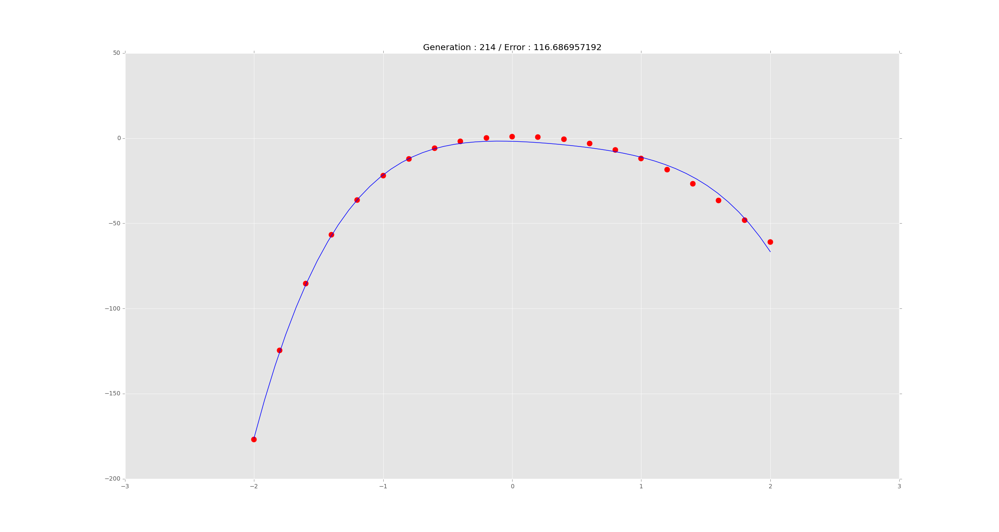

# Genetic Curve Fitting

The objective of this project was to build a genetic algorithm that would find the best coefficients to fit a polynomial to a list of points.

I don't explain the whole project here, instead I wrote an [IPython notebook](http://maxhalford.com/resources/notebooks/genetic-algorithms) on genetic algorithms and more specifically this problem.